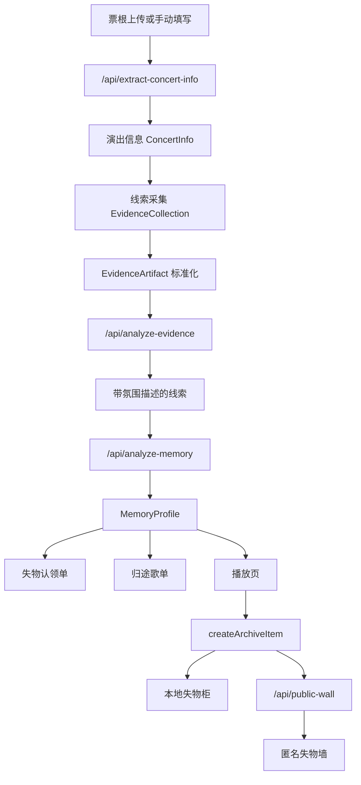

# MVP Integration Map

这份文档用于说明当前产品框架如何拼接成一条完整链路，以及后续 API 应该接在哪里。

## 主链路

## 数据边界

| 数据 | 类型 | 来源 | 用途 |
| --- | --- | --- | --- |
| 演出信息 | `ConcertInfo` | 票根识别或手动输入 | 判断现场、歌手、城市和推荐语境。 |
| 线索输入 | `EvidenceInput` | 用户填写或上传 | 保留原始线索，进入记忆分析。 |
| 标准化证据 | `EvidenceArtifact` | 前端处理 | 统一图片、视频、音频、文字格式。 |
| 记忆画像 | `MemoryProfile` | AI 或本地规则 | 驱动失物认领单、路线、播放页和结尾页。 |
| 归档记录 | `ArchiveItem` | 当前记忆画像生成 | 绑定用户 ID，进入失物柜和失物墙。 |

## 当前真实可运行的部分

- 用户可以走完整页面流程。
- 文字输入会真实影响情绪标签、失物名称、叙事文案和推荐歌单。
- 视频上传会在浏览器提取首帧，作为后续视觉理解输入。
- 音频上传会在浏览器提取简单音频特征，再转成文字描述。
- 本地用户 ID 会保存在浏览器中，刷新后仍能恢复。
- 最近一次失物柜记录会按用户 ID 保存到 localStorage。
- Supabase 未配置时，失物墙仍能显示本次结果和演示便签。

## 当前 API-ready 的部分

- 票根真实 OCR 或视觉识别：已接到 `/api/extract-concert-info`，未配置时回退本地规则。
- 图片和视频首帧视觉理解：接到 `/api/analyze-evidence`。
- 音频情绪理解：先由 Web Audio API 生成特征描述，再接到 `/api/analyze-evidence`。
- 文字情绪和主题理解：接到 `/api/analyze-evidence` 或 `/api/analyze-memory`。
- AI 生成失物认领单和跨歌手推荐歌单：接到 `/api/analyze-memory`。
- 真实留言墙发布和展示：接到 `/api/public-wall` 的 Supabase 配置。

## Fallback 策略

每个外部服务都有本地回退：

- AI 缺失或失败时，使用本地规则分析。
- AI 推荐为空时，使用本地歌曲标签库补足。
- Supabase 缺失或失败时，使用本地演示失物墙。
- 用户输入太少时，使用默认 Demo 结果，保证现场展示不空白。

这样做的目的不是替代 AI，而是保证参赛演示稳定，同时保留真实接入能力。
